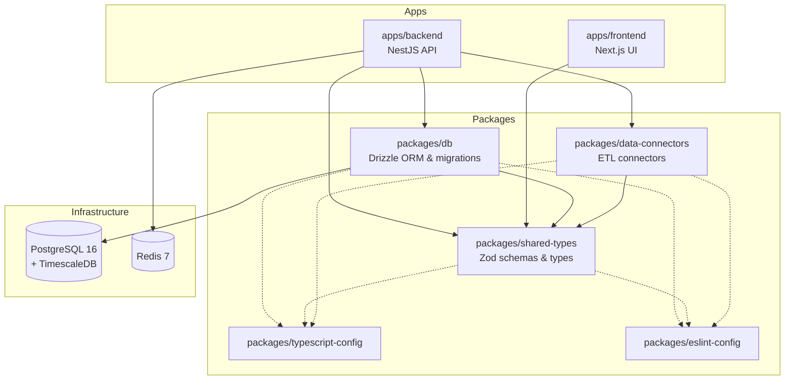

# OpenDevelopment

A global, open-source platform for aggregating, visualizing, and cross-correlating development data from authoritative sources.

[](https://github.com/opendevelopment/opendevelopment/actions/workflows/ci.yml)
[](./LICENSE)

## Overview

OpenDevelopment brings together data from the World Bank, WHO, UNICEF, FAO, UN SDG, and other authoritative sources into a unified platform. Researchers, policymakers, and citizens can explore development indicators, discover cross-dataset correlations, and propose new analyses.

## Architecture



## Tech Stack

- **Monorepo**: Turborepo + pnpm workspaces
- **Language**: TypeScript (strict mode)
- **Database**: PostgreSQL 16 + TimescaleDB
- **ORM**: Drizzle ORM
- **Cache**: Redis 7
- **Validation**: Zod
- **Testing**: Vitest
- **CI/CD**: GitHub Actions

## Quick Start

### Prerequisites

- Node.js 22+ (see `.nvmrc`)
- pnpm 9+
- Docker & Docker Compose

### Setup

```bash
# Clone the repository
git clone https://github.com/opendevelopment/opendevelopment.git
cd opendevelopment

# Install dependencies
pnpm install

# Copy environment variables
cp .env.example .env

# Start infrastructure and seed database
./infrastructure/scripts/setup.sh

# Build all packages
pnpm turbo build

# Run development servers
pnpm turbo dev
```

### Available Commands

| Command | Description |
|---------|-------------|
| `pnpm turbo build` | Build all packages |
| `pnpm turbo dev` | Start development servers |
| `pnpm turbo lint` | Lint all packages |
| `pnpm turbo type-check` | Type-check all packages |
| `pnpm turbo test` | Run all tests |
| `pnpm turbo db:push` | Push database schema |
| `pnpm turbo db:init-timescale` | Initialize TimescaleDB |
| `pnpm turbo db:seed` | Seed sample data |

## Data Sources

| Source | Type | API |
|--------|------|-----|
| World Bank | REST API | `api.worldbank.org/v2` |
| WHO GHO | OData API | `ghoapi.azurewebsites.net/api` |
| UNICEF | SDMX API | `sdmx.data.unicef.org` |
| UN SDG | REST API | `unstats.un.org/sdgapi` |
| FAOSTAT | REST API | `fao.org/faostat/api/v1` |
| RSS Feeds | RSS/Atom | Various |

## Contributing

We welcome contributions! See [CONTRIBUTING.md](./CONTRIBUTING.md) for guidelines on:

- Adding new data source connectors
- Proposing cross-dataset correlations
- Code style and PR process

## License

[MIT](./LICENSE)
